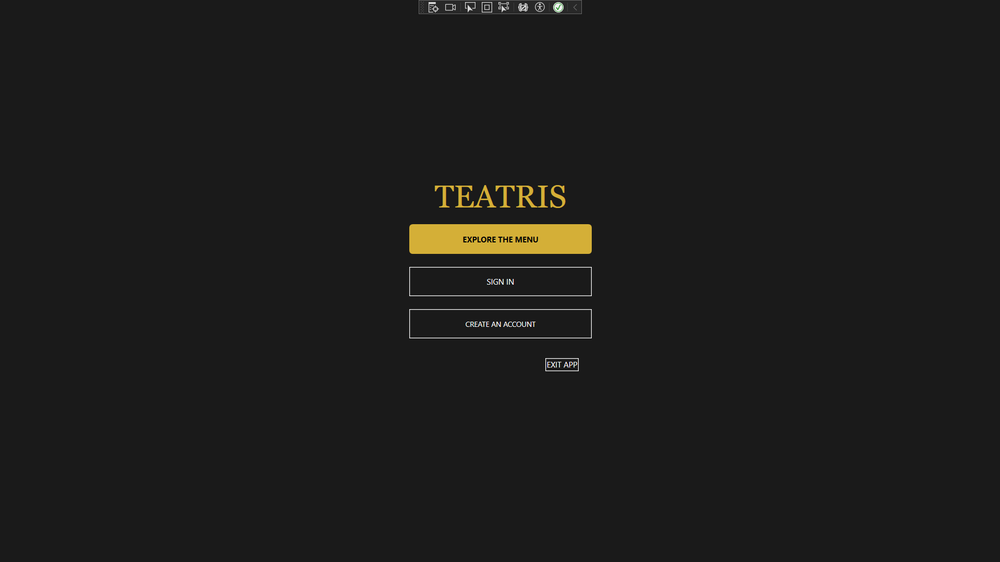
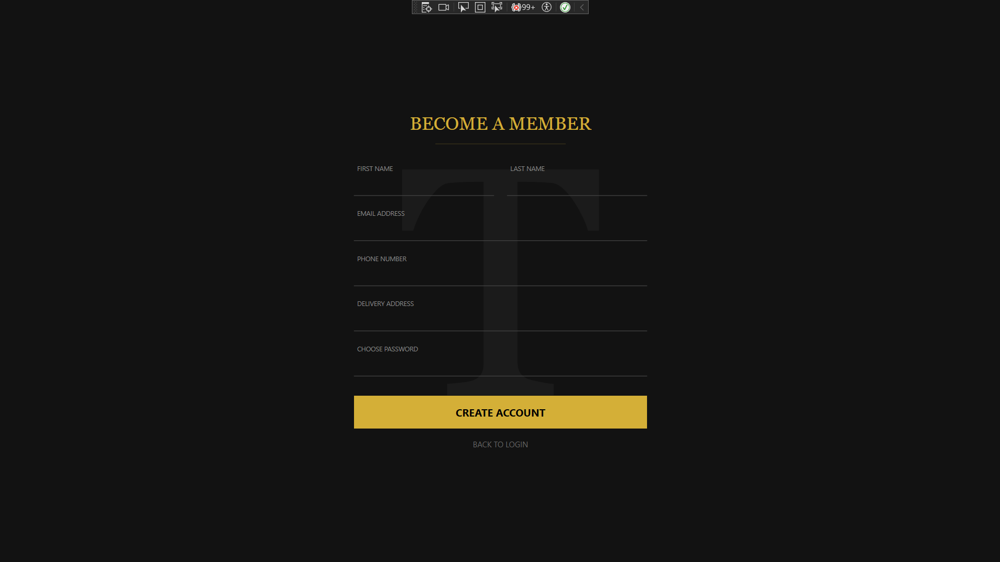
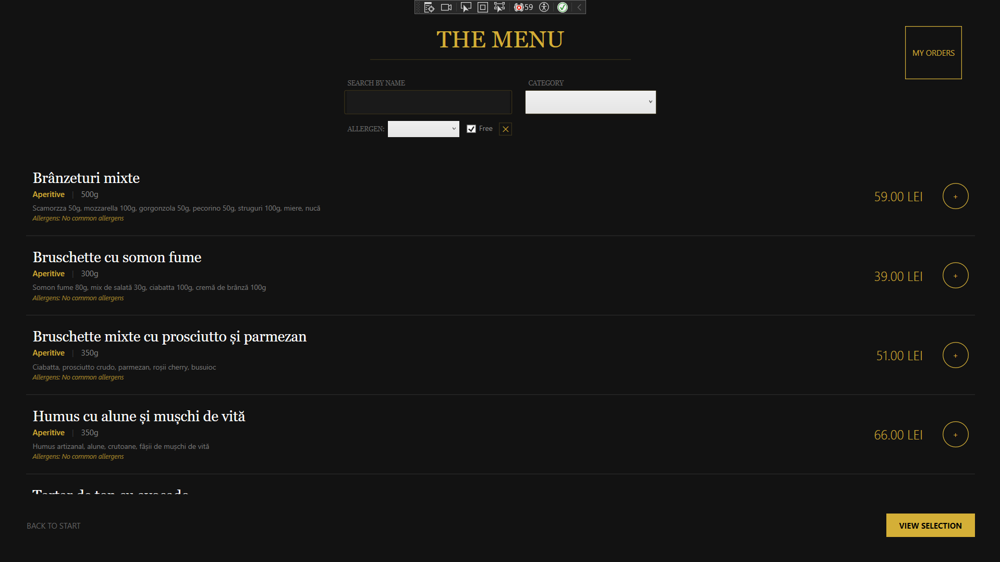
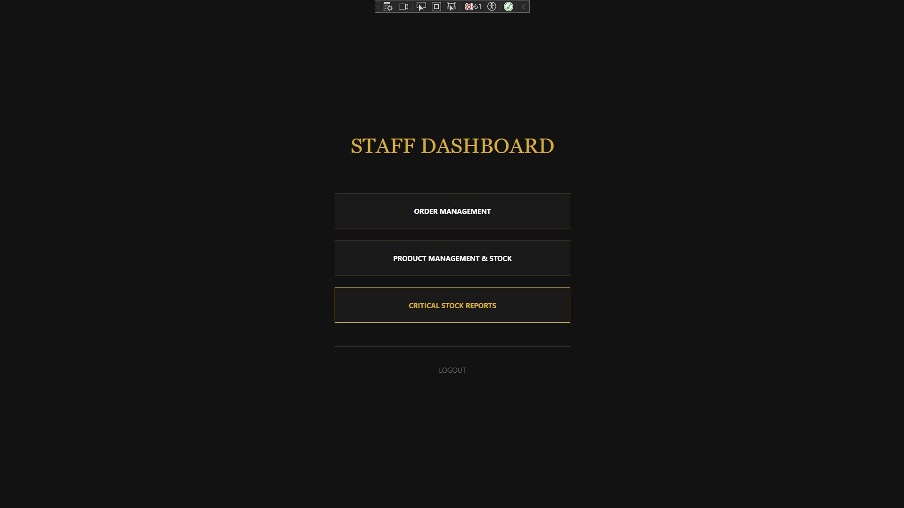
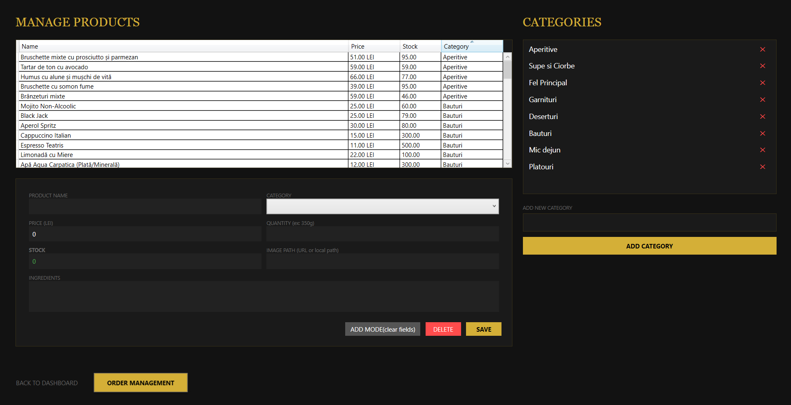

# RestaurantOrderApp

A modern desktop application developed in WPF using the MVVM pattern, structured on a multi-layered architecture (Data Access Layer and Business Logic Layer) to ensure clean separation of concerns in managing a restaurant's order flow.

## 🚀 Key Features

* **Role-Based Authentication**: Secure login for Clients and Administrators.
* **Menu Management**: Browse products by category, check ingredients and view allergens.
* **Ordering Process**: Add products to the cart, calculate total costs and place orders.
* **Staff/Admin Dashboard**:
    * Inventory and product management.
    * Monitor and update order statuses.
    * Sales report generation.
* **Database Integration**: Powered by SQL Server via Entity Framework Core.

## 🛠️ Tech Stack

* **.NET 8.0** & **WPF**
* **Entity Framework Core** (SQL Server)
* **MVVM Pattern** (implemented using `BaseViewModel` and `RelayCommand`)
* **Microsoft Data SqlClient** for stored procedures

## 📂 Project Structure

* **Models/**: Database entities (`User`, `Product`, `Order`, etc.) and the `RestaurantDbContext`.
* **ViewModels/**: Application logic and state management for the UI.
* **Views/**: XAML-based user interfaces.
* **Helpers/**: Utility classes for commands, user sessions, and converters.

## ⚙️ Setup and Installation

1. Clone the repository: git clone https://github.com/cosminpelin21/RestaurantOrderApp.git
2. Database Setup:

   *Open SQL Server Management Studio (SSMS).

   *Open the script.sql file provided in this repository.

   *Execute the script (F5) to create the RestaurantDB database, tables, and stored procedures.
3. Test Credentials:
   
   *The script includes seed data for immediate testing:

         Admin/Staff: admin@restaurant.ro | Password: admin123

         Client: maria.p@email.com | Password: client123

## 👥 Author

* **Cosmin Pelin**

## 📷 Screenshots

## 🐛 Feedback & Bug Reports

While I have thoroughly tested the application, I am sure there is always room for improvement.

If you encounter any bugs, have suggestions for new features, or spot any issues, **I would greatly appreciate your feedback!** You can contribute by: **contacting me directly** at *cosminpelin21@gmail.com*.

Your experience and insights are extremely valuable to me as I continue to learn and improve my development skills. Thank you!

